# Create AWS Palace FEM Models from GDSII layout files

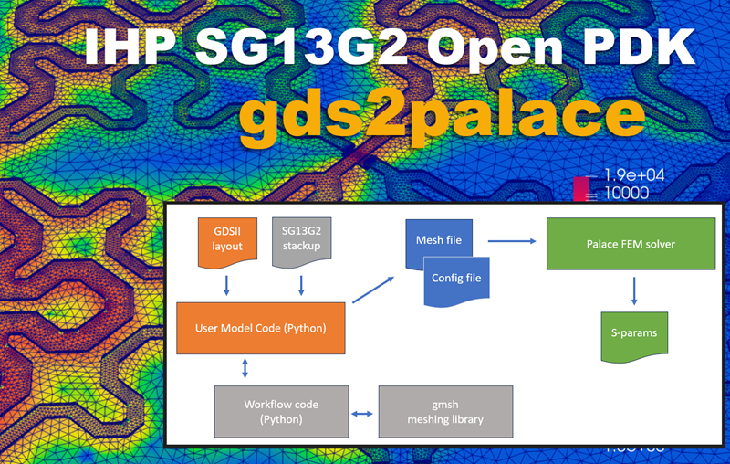

The files provided here enable RFIC FEM simulation using AWS Palace from GDSII layouts created in [IHP SG13G2](https://github.com/IHP-GmbH/IHP-Open-PDK) RFIC technology. 

Palace, for PArallel LArge-scale Computational Electromagnetics, is an open-source, parallel finite element code for full-wave 3D electromagnetic simulations. It can be scaled from single computer to large high performance simulation clusters and cloud-based computing.

https://awslabs.github.io/palace/stable/

https://aws.amazon.com/de/blogs/quantum-computing/aws-releases-open-source-software-palace-for-cloud-based-electromagnetics-simulations-of-quantum-computing-hardware/

The gds2palace workflow in this repository is pre-configured for GDSII layout files in the [IHP SG13G2 Open PDK.](https://github.com/IHP-GmbH/IHP-Open-PDK)
Special thanks to IHP and the public funded German project FMD-QNC (16ME0831) https://www.elektronikforschung.de/projekte/fmd-qnc for financial support, which has contributed to this work.

# Documentation
An extensive documentation is available in PDF format here:
[gds2palace FEM workflow for IHP](./doc/gds2palace_workflow_October_2025.pdf) 

# System requirements
This workflow is designed for Linux systems. It creates model files for the AWS Palace FEM solver, 
please refer to https://awslabs.github.io/palace/stable/install/ for installing Palace.

In addition to Palace that is required for simulation of the output files, these Python modules are required to use the gds2palace workflow:
- gdspy (version 1.6.13 or later recommended)
- gmsh
- scikit-rf (for the script that converts Palace output to Touchstone SnP format)

Documentation assumes that you have created a Python venv named "palace" in ~/venv/palace and installed the modules there.

## Installing Palace

AWS Palace itself can be installed in multiple ways. For a smooth interaction with the gds2palace workflow, it is recommended to create some scripts that help running the model and convert the Palace results to SnP Touchstone files.

For development of this workflow, Palace was installed using the Singularity/Apptainer installation method. This was rather simple and straightforward, even with no knowledge about container usage. The resulting apptainer file palace.sif can be integrated very easily in a Linux system like the Ubuntu 24.04 system used here, and can then be moved to other Linux machines using simple copy of the container file. Highly recommended! The script to start Palace from the apptainer is included in the scripts directory in this repository.

Notes on installing the Palace solver using apptainer:
[Installing Palace using Apptainer](./doc/Installing_Palace_using_Apptainer.pdf) 

But of course, you can also use one of the other installation methods described on the AWS Palace web site. The gds2palace workflow does not change, it only creates the input files for Palace and does not care how you installed Palace, or on what platform you run the actual Palace simulation from these model files.

# Workflow
The screenshot below shows the workflow: user input is the GDSII layout file and a Python script that configures the simulation model, pointing to the GDSII file and to the technology stackup file and defining simulation settings. 

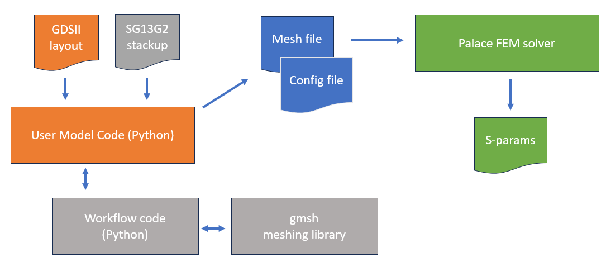

For more details, please have a look at the detailed user's guide.
[Palace FEM workflow for IHP gds2palace](./doc/Palace_workflow_October_2025.pdf) 

# Minimum configuration
The screenshot below shows a minimum configuration, which consists of the XML technology stackup, the GDSII layout, one simulation model file (here named run_inductor_diffport.py)  and the gds2palace utility modules with all the “behind the scenes” code that you don’t need to modify.

# Running gds2palace
The simulation model file (Python code) can be run on the command line. After reading and processing the input files, a 3D viewer comes up and shows the resulting 3D model. This viewer is the graphical interface of the gmsh meshing library, and provides many options for inspection of the model. At this point, the model is not meshed yet, so that we can see the raw geometries.

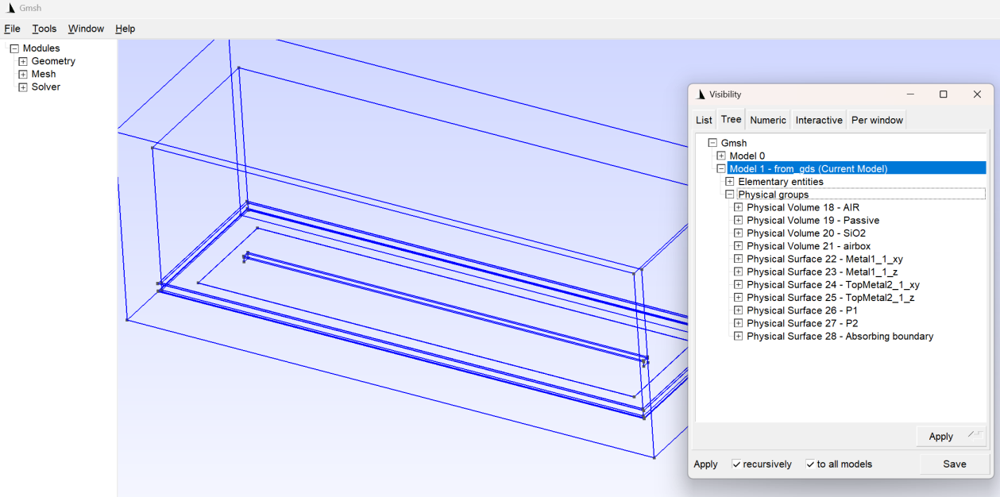

To see the structure of the 3D model, you can go to Tools > Visibility. In the screenshot, you can see that dielectric boxes (SiO2, Passive, AIR etc) have been added around the GDSII polygons, with an offset value in xy direction from the “margins” parameter in the model file. Around that, we have another layer of air on all six sides, using the same margins value.

Metals have been created as surfaces. All polygons on each layer are merged, if possible, and then each of the resulting polygons is created as a separate surface. To be more precise, we have two surfaces for each polygon: the horizontal (xy) surfaces and the vertical (z) surfaces are assigned to different groups, for reasons explained later in this document.

You can also see two ports P1 and P2 created as surfaces. The outer simulation boundary is this example is a surface “Absorbing boundary” that is defined as absorbing boundary in the Palace config file. When we are done with inspecting the model (which is optional, no user action is required!), the gmsh viewer window can be closed to proceed with meshing.

After closing the gmsh geometry preview, the simulation model script will mesh these geometries, which can take a while and will show lots of status information on the command line. When meshing is completed, the gmsh 3D viewer will be displayed again, showing the overall mesh.

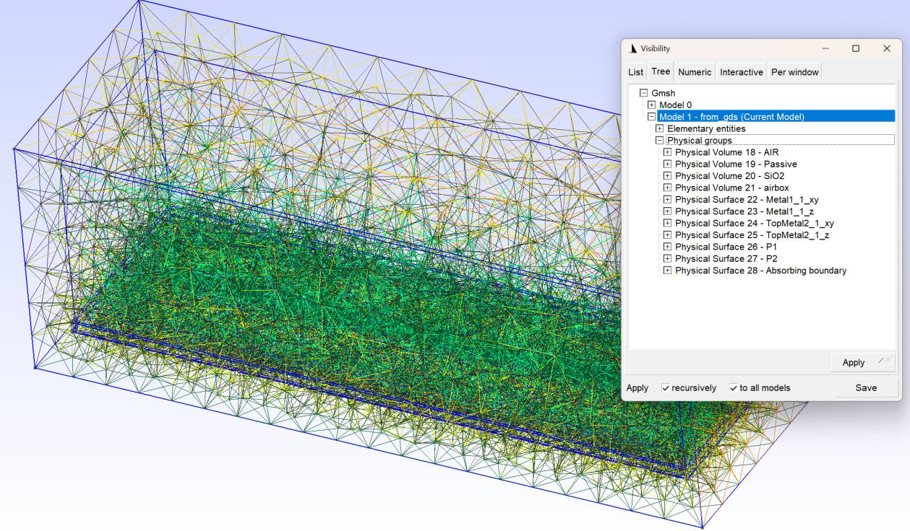

This is too complex to see anything, but we can now go to Tools > Visibility and select one or more groups to be displayed:

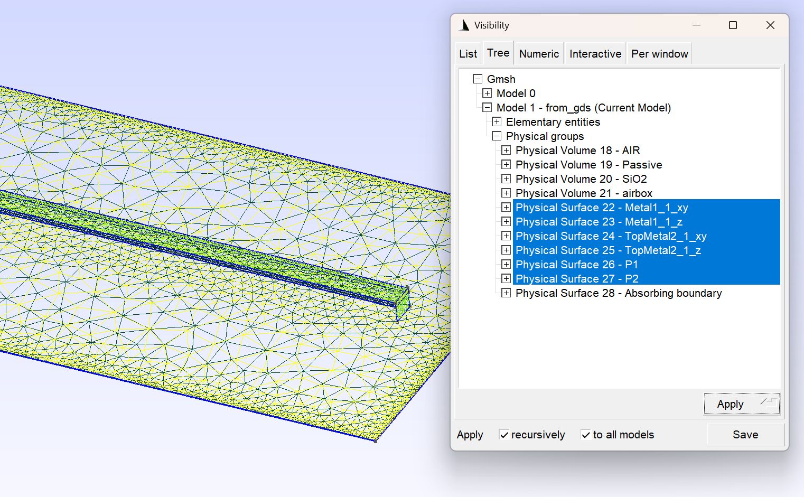

SiO2 around the metals:

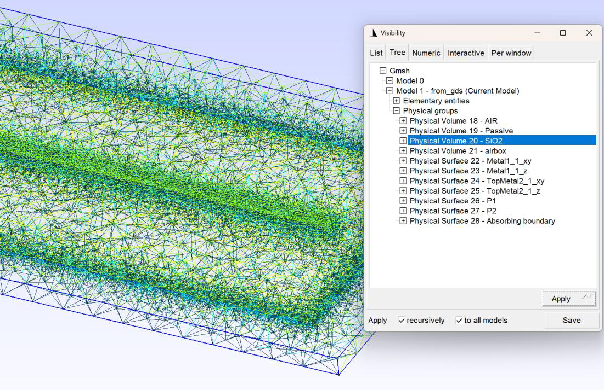

When you are done with inspection of the model (which is optional, no user action is required!), the gmsh viewer window can be closed to finish model generation.
The workflow code has now created the required file to start Palace: the simulation control file config.json and the mesh file.

To simplify running the solver, in addition to mesh file and config file, a script file was also created named “run_sim”.
This starts a script “run_palace” where you can define in detail how to run Palace. It is recommended that you place this run_palace script in your PATH, configured for the actual machine where you want to run Palace.

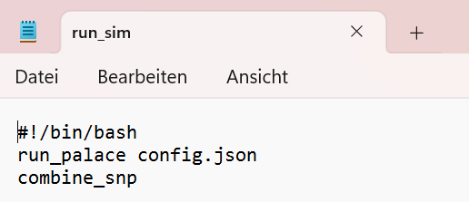

For workflow development and test, Palace was installed into an apptainer container, as documented in the Palace documentation in chapter “Build using Singularity/Apptainer”. The script “run_palace” was then configured to start Palace inside the palace_014.sif container, which is located in the user’s home directory, and passes one command line argument (the config.json file). The additional parameter -np 16 tells palace to run using 16 threads. This will partition the simulation domain into pieces, each running in a separate process, and the combine results into one output directory.

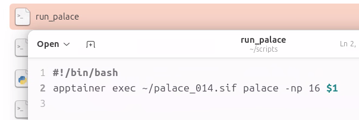

Running Palace is not very spectacular, the simulation progress is shown in the terminal window.

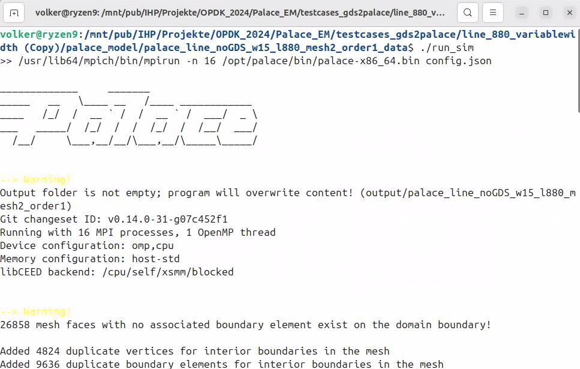

When “run_palace” is finished, Palace output files are created in the “output” directory below the simulation model directory. S-parameters are in *.csv file format, which we need to convert now.

To do that conversion, the run_sim script where we started simulation with “run_palace” executes another command “combine_snp”.
combine_snp is a script that searches for Palace s-parameter files (port-S.csv) and converts them to Touchstone file format, it is provided in the scripts folder of this repository. 

If the model was simulated for selected port excitations only, missing rows in the S-parameter file will be padded with zeros.

It should be noted that Palace frequency domain simulation cannot go down to 0 Hz, and the workflow script will replace any 0 Hz start frequency by a low value like 1 GHz.If simulation results include such low frequency data, combine_snp will create an additional S-Parameter file with suffix “_dc”, with a DC value extrapolated from the EM simulated data.1 Always check that DC extrapolated dataset carefully before use!

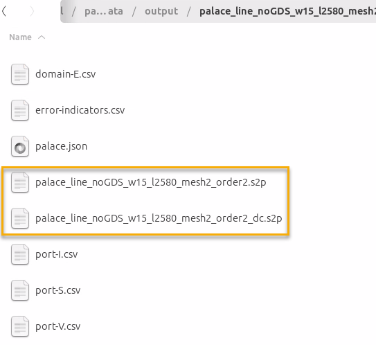

# Showcase 

As an example what is possible using this workflow, the screenshot below shows the simulation of a compact on-chip Butler matrix layout for 93 GHz created by Ardavan Rahimian for IHP OpenPDK  Tapeout July 2025. The design is available at https://github.com/IHP-GmbH/TO_July2025/tree/main/W_Band_Butler_Matrix_IC

Author of this design: https://ieeexplore.ieee.org/author/37535797800

For the simulation shown below, port 1 was excited at a frequency of 93 GHz. Simulation took ~ 4 minutes for that one excitation at one frequency.

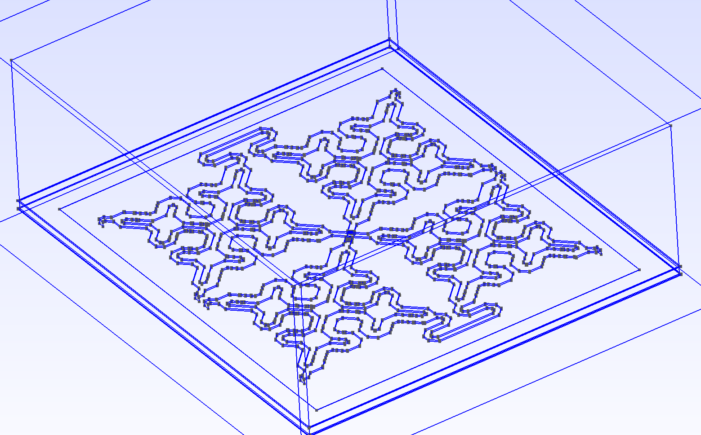

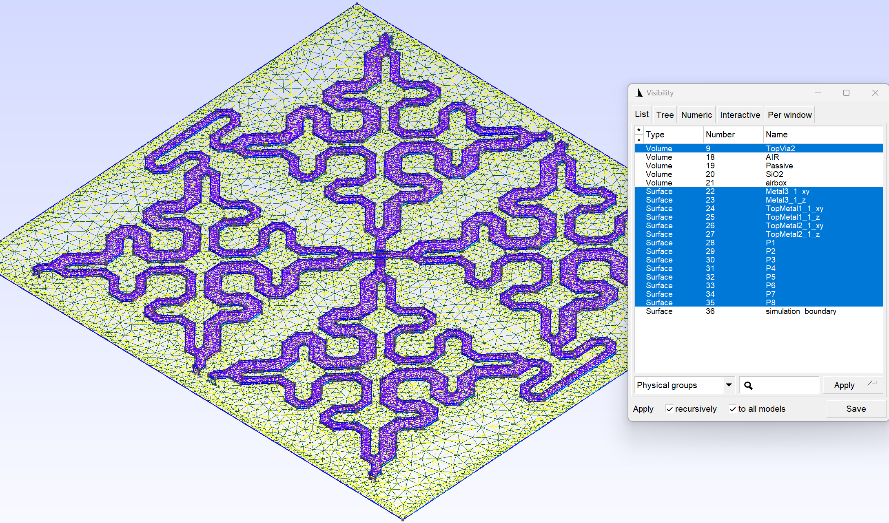

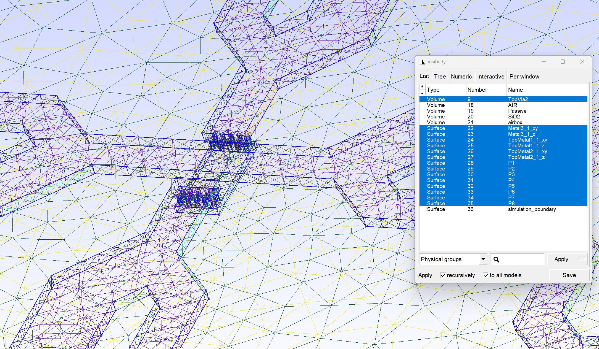

Current density at 93 Ghz:

